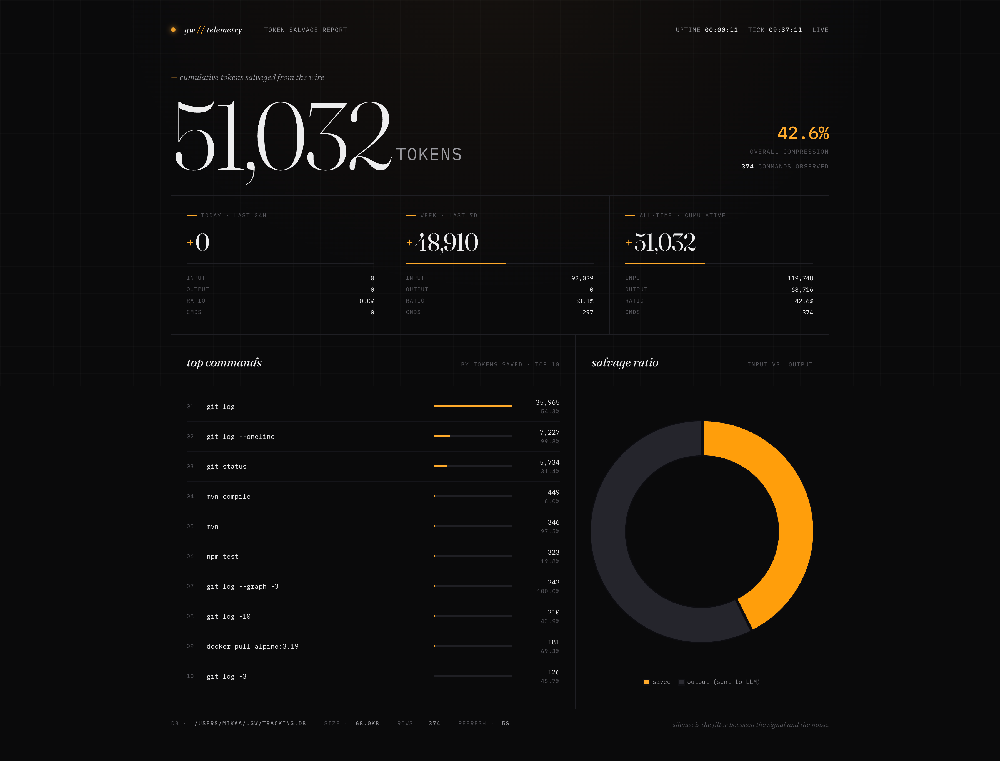
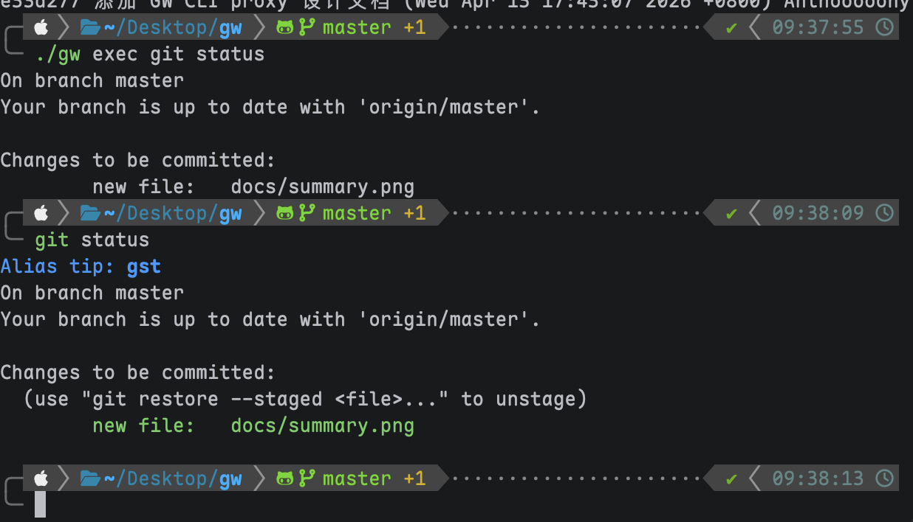
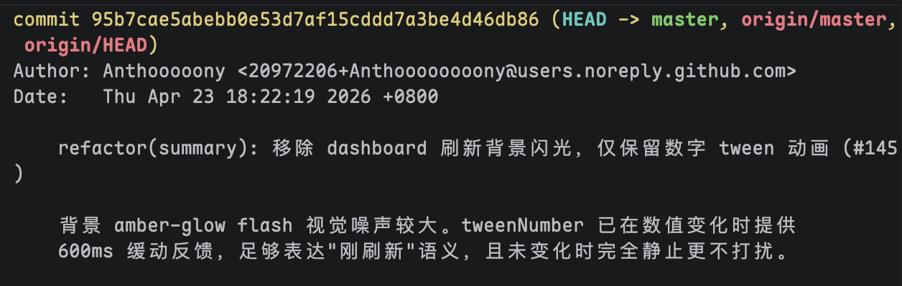
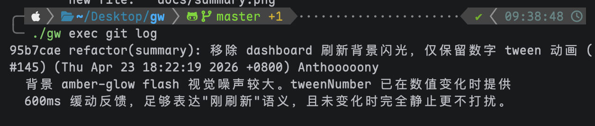

<h1 align="center">gw</h1>

<p align="center">
  <a href="https://github.com/Anthoooooooony/gw/actions/workflows/ci.yml"></a>
  <a href="https://github.com/Anthoooooooony/gw/releases/latest"></a>
  <a href="https://pkg.go.dev/github.com/Anthoooooooony/gw"></a>
</p>

<p align="center">
  <strong>Output-compressing CLI proxy for AI coding agents.</strong><br>
  通过 PreToolUse Hook 拦截 shell 命令，本地执行后压缩冗余输出，降低 LLM context 消耗。
</p>

<p align="center">
  
</p>

---

## Highlights

- **零侵入集成**：一条 `gw init` 自动注入 Claude Code PreToolUse Hook，对 agent 透明。
- **双层过滤器架构**：Go 硬编码（针对高频命令深度优化）+ TOML 声明式规则（零代码扩展长尾命令）。
- **批量 / 流式双执行路径**：由过滤器接口实现决定，长驻进程与短命令各取所需。
- **本地 dashboard**：`gw summary` 启动本地 HTTP server + SSE 实时刷新，非 TTY / SSH / CI 环境自动降级到纯文本。
- **全量原文落盘**：SQLite 持久化每次执行，支持事后 `gw inspect --raw` 回溯；按阈值自动 VACUUM 控制体积。
- **单二进制分发**：Go + CGO（SQLite）交叉编译，静态资源 `go:embed` 嵌入，无外部依赖。

## 效果对比

在真实多模块 Maven 构建（905 行日志 fixture）上实现 **95%** 压缩率。各命令典型表现：

| 命令 | 典型压缩率 | 技术 |
|------|-----------|------|
| `git status` | ~30% | 正则 |
| `git log` | ~45% | 紧凑格式 + 去 trailer |
| `mvn compile/test` | **95%** | 11 态状态机（基于 Maven 源码事件模型） |
| `gradle build/test` | ~80% | 白名单 + 状态机 |
| `java -jar *.jar` | ~62% | 流式过滤（banner / Hibernate / 内部引擎日志） |
| `pytest` | 99% / 82% | 成功 / 失败（summary + FAILURES 锚点） |

<table>
<tr>
<th align="center"><code>git status</code> 压缩前后对比</th>
</tr>
<tr>
<td></td>
</tr>
</table>

<table>
<tr>
<th align="center">Before</th>
<th align="center">After</th>
</tr>
<tr>
<td></td>
<td></td>
</tr>
<tr>
<td colspan="2" align="center"><sub><code>git log</code> 压缩前后对比</sub></td>
</tr>
</table>

完整场景基线见 `filter/testdata/scenario_baseline.json`，维护流程见 [`CONTRIBUTING.md`](./CONTRIBUTING.md#场景化压缩率-baseline)。

## Installation

### 预编译二进制

从 [GitHub Releases](https://github.com/Anthoooooooony/gw/releases/latest) 下载对应平台 `tar.gz`，解压后移入 `PATH`：

```bash
# macOS Apple Silicon
tag=$(curl -fsSL https://api.github.com/repos/Anthoooooooony/gw/releases/latest | grep -m1 '"tag_name":' | cut -d'"' -f4)
curl -L -o gw.tar.gz "https://github.com/Anthoooooooony/gw/releases/latest/download/gw_${tag}_darwin_arm64.tar.gz"
tar xzf gw.tar.gz && sudo mv gw /usr/local/bin/ && gw version
```

```bash
# Linux amd64
tag=$(curl -fsSL https://api.github.com/repos/Anthoooooooony/gw/releases/latest | grep -m1 '"tag_name":' | cut -d'"' -f4)
curl -L -o gw.tar.gz "https://github.com/Anthoooooooony/gw/releases/latest/download/gw_${tag}_linux_amd64.tar.gz"
tar xzf gw.tar.gz && sudo mv gw /usr/local/bin/ && gw version
```

当前预编译覆盖：`linux_amd64` / `darwin_arm64`。Intel Mac、Linux arm64、Windows 使用下方源码安装。

### 源码安装

```bash
go install github.com/Anthoooooooony/gw@latest
```

**CGO 依赖**：`mattn/go-sqlite3` 要求 `CGO_ENABLED=1` 与 C 编译器。

- macOS：Xcode Command Line Tools（`xcode-select --install`）
- Linux：`build-essential` 或等价包
- Alpine：额外安装 `gcc musl-dev sqlite-dev`

## Quick start

```bash
gw init                # 安装 Claude Code PreToolUse Hook（一次）
gw exec git status     # 验证：直接使用
gw exec mvn test       # 验证：多模块 Maven 构建
gw summary             # 启动本地 dashboard 查看节省统计
gw uninstall           # 如需卸载
```

Hook 安装后，Claude Code 自动将匹配的命令路由至 gw，对 agent 完全透明。

## How it works

```
Claude Code agent 发起 Bash 工具调用
          │
          ▼
  PreToolUse Hook (stdin JSON)
          │
          ▼
  gw rewrite     → updatedInput.command = "gw exec <原命令>"
          │
          ▼
  gw exec        → PARSE → ROUTE → EXECUTE → FILTER → PRINT → TRACK
          │
          ▼
  Claude Code 收到压缩后的输出
```

六阶段 pipeline、批量 vs 流式路径、过滤器接口模型详见 [`docs/DEVELOPING.md`](./docs/DEVELOPING.md#架构总览)。

## Configuration

常用环境变量。完整列表（含 `gw claude` 代理调优参数）见 [`docs/DEVELOPING.md`](./docs/DEVELOPING.md#gw-claude-相关环境变量)。

| 变量 | 默认 | 用途 |
|------|------|------|
| `GW_CMD_TIMEOUT` | `10m` | 命令执行超时；`0` / `off` / 负值禁用 |
| `GW_DB_PATH` | `~/.gw/tracking.db` | tracking DB 路径；HOME 只读时降级到 `$TMPDIR/gw-tracking.db` |
| `GW_DB_MAX_BYTES` | `104857600`（100 MiB） | DB 体积硬阈值，超限时 `gw summary` 自动按时间裁剪并 VACUUM |
| `NO_BROWSER` | 未设 | 非空时 `gw summary` 启 server 但不自动打开浏览器 |

## Documentation

| 文档 | 内容 |
|------|------|
| [`docs/USAGE.md`](./docs/USAGE.md) | 使用指南：介入机制、命令参考、自定义 TOML 规则、历史查询、数据隐私、卸载 |
| [`docs/DEVELOPING.md`](./docs/DEVELOPING.md) | 架构总览、六阶段管道、双层过滤器、项目结构、扩展过滤器、`gw claude` 代理调试 |
| [`CONTRIBUTING.md`](./CONTRIBUTING.md) | 贡献流程：分支规范、Conventional Commits、自动化 release workflow、场景压缩率 baseline |
| [`docs/DECISIONS.md`](./docs/DECISIONS.md) | ADR-lite 决策记录（含否决方案） |
| [`CLAUDE.md`](./CLAUDE.md) | Claude Code 协作时的项目级约定与关键不变式 |

## Limitations

- **仅支持 Claude Code**：`gw init` 只适配 Claude Code 的 PreToolUse Hook；Cursor、Copilot 等需单独适配。
- **有损压缩**：过滤会丢弃部分原始信息。关键命令可用 `gw -v exec` 观察压缩详情或直接跳过 gw。
- **SQLite 并发 busy_timeout**：多进程并发写入最多阻塞 ~3s，不影响主输出。
- **Token 估算近似**：使用 `ceil(runes/4)`，非真实 tokenizer，CJK 字符密集输出偏差较大。
- **Windows 平台退化**：进程组终止仅能 kill 主进程，`SIGTERM` 宽限期无效。
- **macOS 用户规则目录**：`os.UserConfigDir()` 返回 `~/Library/Application Support/gw/rules/`，按 Linux 习惯放到 `~/.config/gw/rules/` 将不会被加载。
